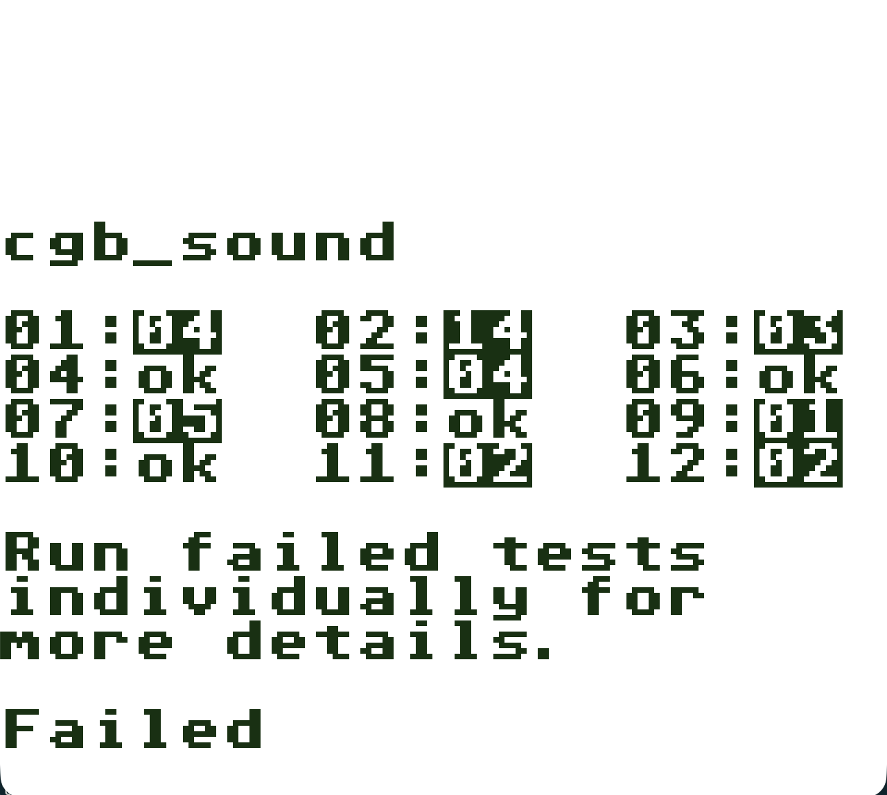
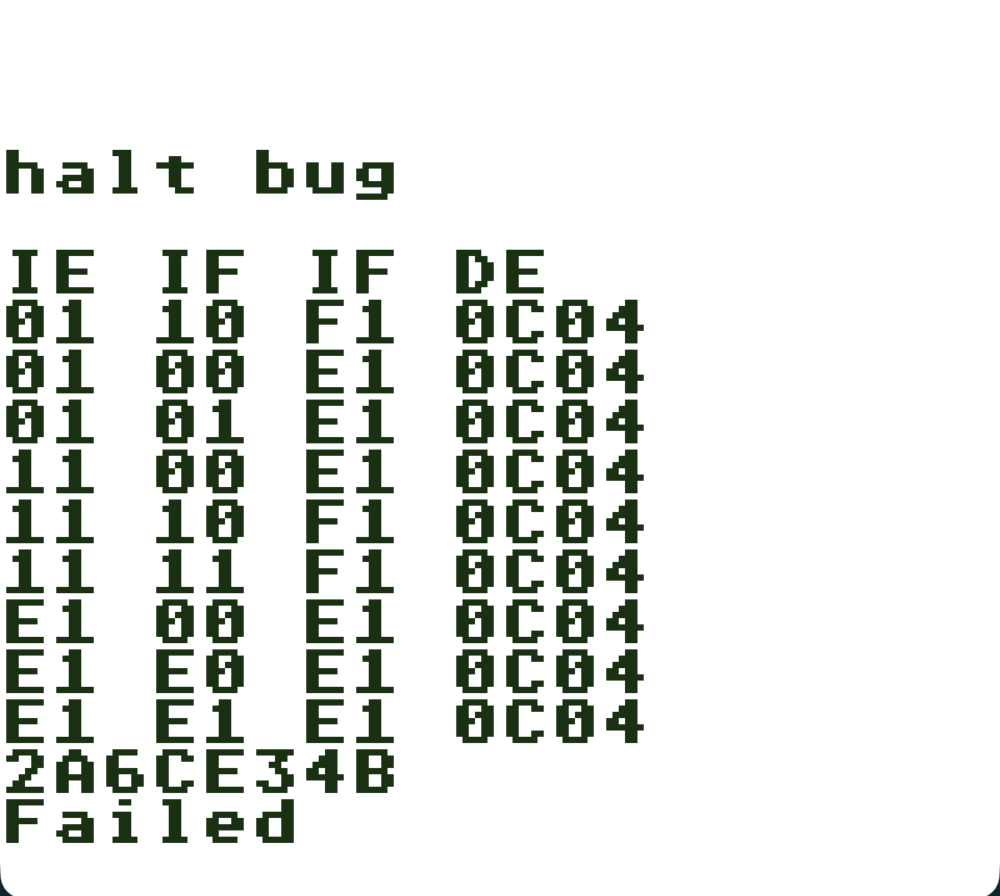
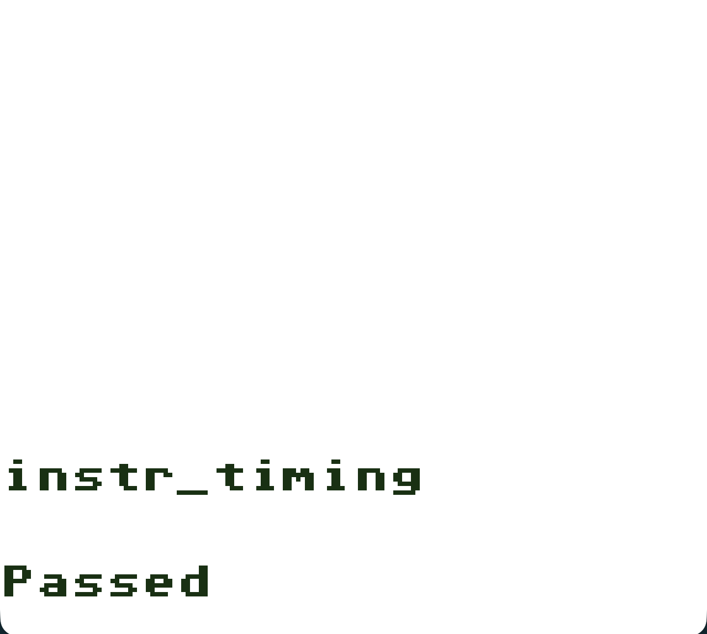
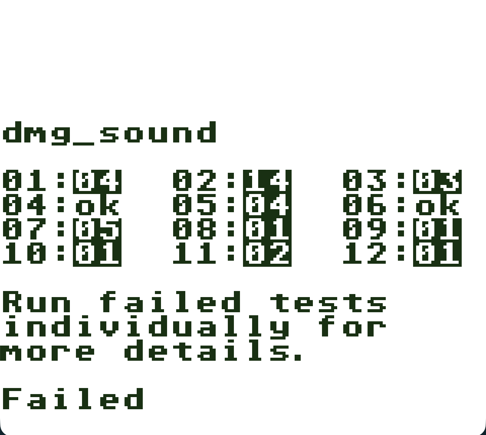
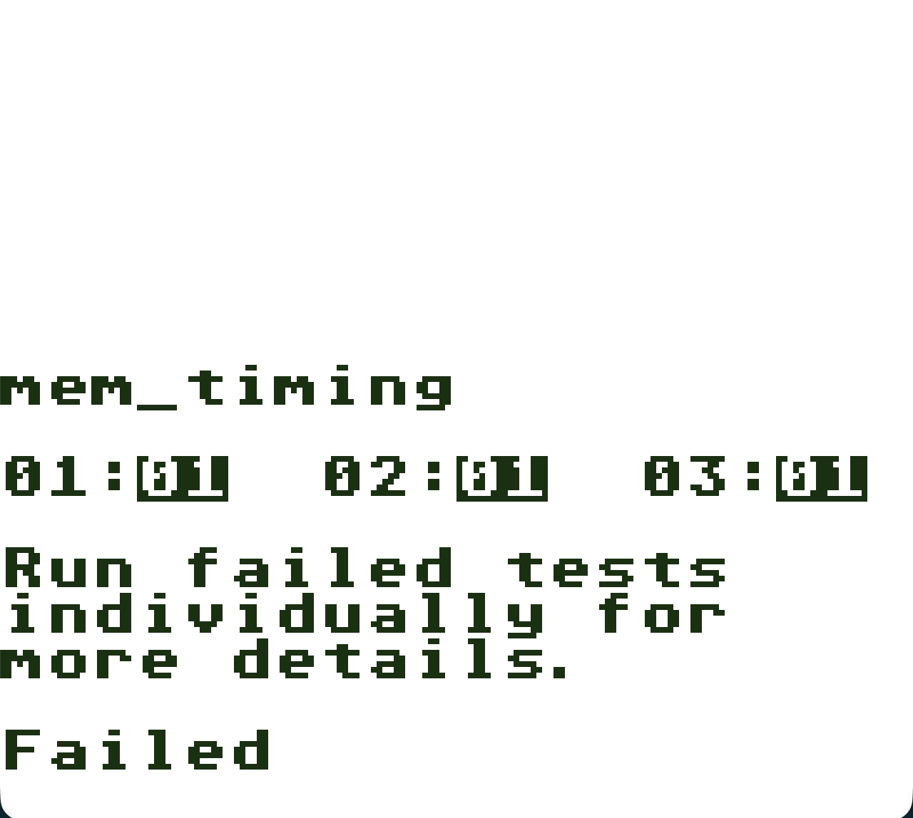
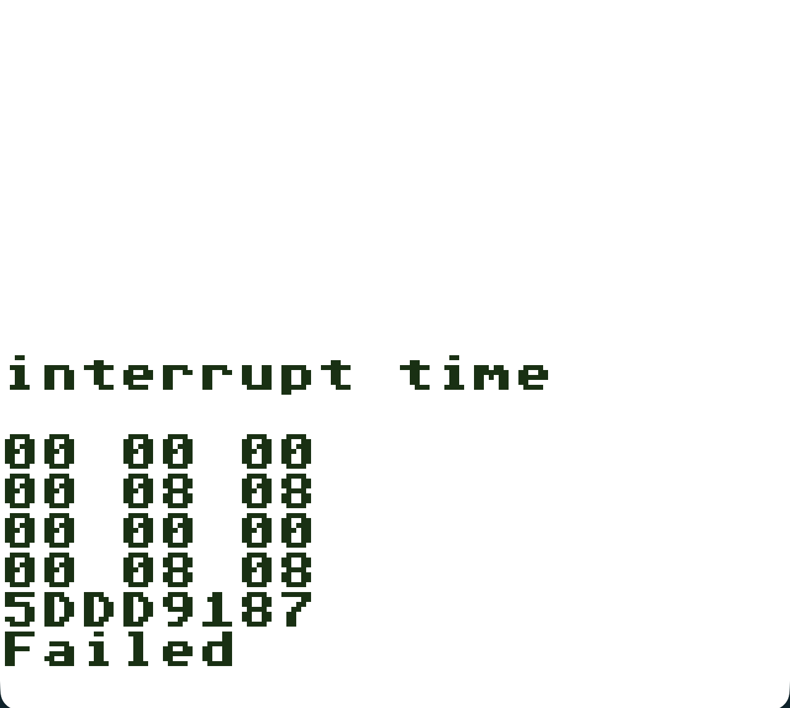

> All notes, future ideas, and potential improvements are tracked [as issues](https://github.com/oscarcpozas/gb_emu_rs/issues).

If you really want to know how a particular computer works, there's no better way to learn than by emulating that computer.
The goal of this project is to emulate the original Game Boy and Game Boy Color in Rust with [100% accuracy compared to the original hardware](https://mgba.io/2017/04/30/emulation-accuracy).

Reading emulator code isn’t easy—at least not for me. To really understand why things are implemented the way they are, 
you first need a solid grasp of how the original hardware works. And since some components don’t behave quite the way 
you might expect, the best way to understand, contribute to, or learn from this project is through the documentation. 
There, I explain each component and the reasoning behind the code in simpler terms, even if more in-depth documentation 
already exists elsewhere. I also walk through what a full console cycle looks like, from execution to rendering a frame on screen.

Check documentation here: https://oscarcpozas.github.io/gb_emu_rs

## Quick set-up

### How to run the emulator?

The emulator can run any Game Boy (`.gb`) game and most Game Boy Color (`.gbc`) games; you just need to pass the file name as an argument when running it:

```bash
cargo run --bin emu -- ./rom/legend_of_zelda.gb
```

### How to generate CPU instructions?

The CPU instructions implemented in `instr.rs` are generated from a [JSON file](./instr-codegen/res/LR35902_opcodes.patched.json) obtained here: https://gbdev.io/gb-opcodes/optables

You can regenerate the processor instructions by doing the following:

```bash
cargo run --bin instr-codegen ./instr-codegen/res/LR35902_opcodes.patched.json ./emu/src/instr.rs
```

### How serve the book?

Documentation on [how the emulator works and the decisions made](https://oscarcpozas.github.io/gb_emu_rs) are compiled here in the form of an mdBook. To build or serve the book, [you need to have the tool installed](https://rust-lang.github.io/mdBook/guide/installation.html).

```bash
mdbook build book
```

```bash
mdbook serve book
```

## Accuracy tests

Blargg’s GB tests are a collection of ROMs designed to verify different parts of the emulated hardware, including CPU 
instructions and timing, graphics, sound, and a few well-known hardware quirks such as the OAM bug and the halt bug. 
I use them to measure how close the emulator is to accurate, full-system emulation.

|  |  |  |
|:----------------------------------:|:----------------------------:|:--------------------------------:|
|           🔴 **FAILED**            |        🔴 **FAILED**         |          🟢 **PASSED**           |

|  |  |  |
|:-----------------------------:|:------------------------------:|:----------------------------------:|
|         🔴 **FAILED**         |         🔴 **FAILED**          |           🔴 **FAILED**            |
